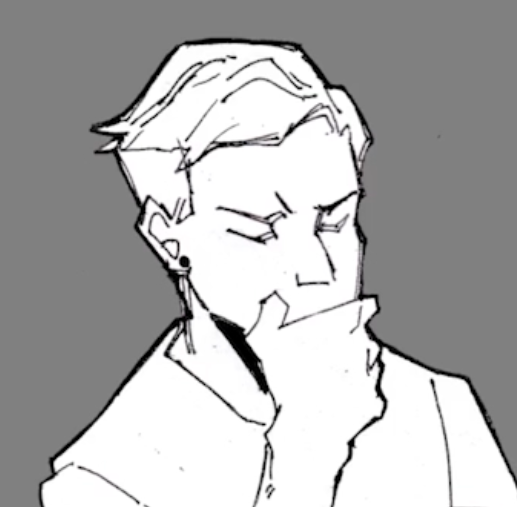

About me:
=========

Hi, I'm David!

As you can probably guess, I am a "software engineer." Well, I **will be** soon. Currently slinging cars and trucks, even though the market has all but crashed. I used to make websites as a kid, taught myself HTML with one of those "...for Dummies" books, but never stuck with it. Figured now would be a great time to pick it back up, and I've been enjoying my time going through Springboard's bootcamp.

That said, when I'm not coding or spending time with my wife and two kids, I enjoy tokusatsu (Japanese special effects shows/movies), reading theology books, and thinking/talking about technology and ethics.

As for the blog? This will be a place for me to collect my thoughts and, hopefully, offer some encouragement to fellow "bootcampers." No guarantees I will **only** post about software engineering. I like too many other things to make that guarantee. I've also done the whole "have an internet following" thing, and I don't like it, so that's not why I'm doing this. I have no interest in chasing that kind of lifestyle.

Uh...Henshin...what?
=========
_Henshin_ is Japanese for "transform," used in the context of going from one form into another. Unless you're Patrick Star and live under a rock, you're familiar with one of the most popular henshin hero shows: **Mighty Morphin' Power Rangers**, which was adapted from the Japanese show **Kyōryū Sentai Zyuranger.** I'm not a huge Super Sentai fan; I'm more of an Ultraman kind of guy. However, I chose the word to "brand" myself, as not only am I *transforming* into a software engineer, but in these shows, just because you transform into something else doesn't mean you **lose** your former identity and experiences. So even though I'm committed to leaving the automotive industry and starting a better life for me and my family, I am *still* committed to providing excellent customer/client support, along with helping my employer refine their day-to-day processes.
